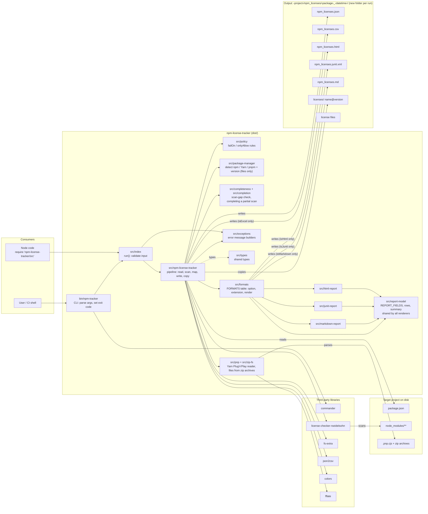
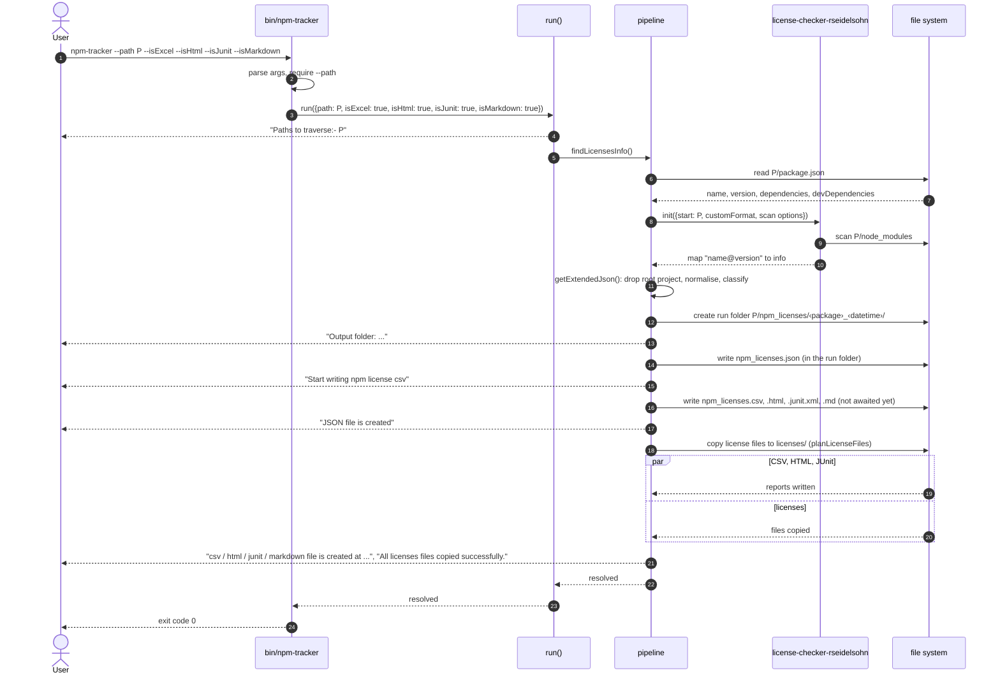
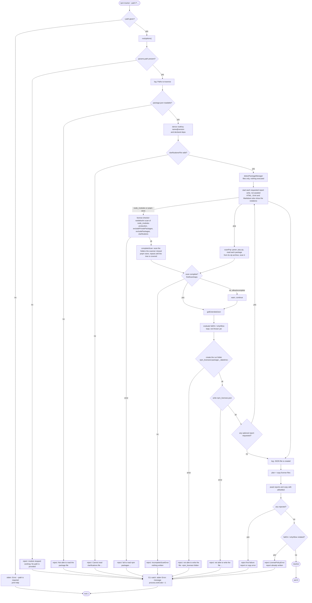
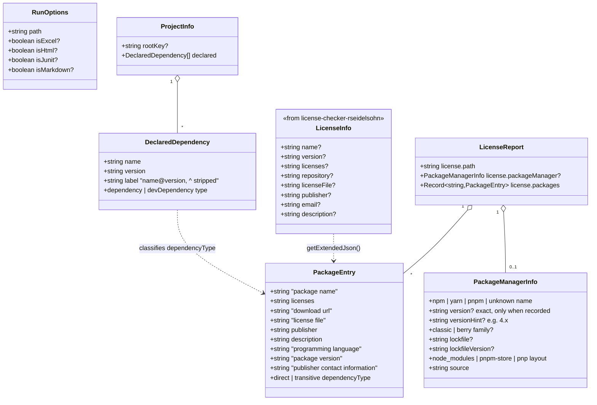
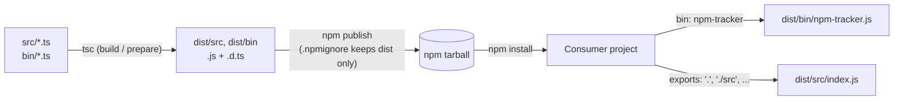

# Architecture

How `npm-license-tracker` is put together: components, runtime flow, error handling, data model and
the build/publish pipeline. Diagrams use [Mermaid](https://mermaid.js.org/) (rendered by GitHub).
For the release process see [publishing.md](publishing.md); all documents are listed in the [docs index](README.md).

## 1. Overview

A single-purpose tool: given a project directory with installed dependencies, it produces a license
inventory (JSON, plus optional CSV, HTML, JUnit and Markdown reports) and a folder of the dependencies' license files.

It has two entry points that share one pipeline:

| Entry point        | Used by                                        | File                |
| ------------------ | ---------------------------------------------- | ------------------- |
| CLI `npm-tracker`  | Humans and CI (`--path`, `--isExcel`, `--isHtml`, `--isJunit`, `--isMarkdown`, ...) | `bin/npm-tracker.ts` |
| `run()` API        | Other Node code (`require('npm-license-tracker/src')`) | `src/index.ts` |

The actual license discovery is delegated to [`license-checker-rseidelsohn`](https://www.npmjs.com/package/license-checker-rseidelsohn)
(the maintained fork of `license-checker`, ESM-only, loaded with a dynamic `import()`); this package adds the project's declared-dependency classification, a stable report format, file copying and CSV.

## 2. Component view



Responsibilities, one line each:

- **`bin/npm-tracker.ts`**: argument parsing (`commander`), `--path` validation, process-level concerns
  (process title, `uncaughtException` handler, exit code). Contains no business logic.
- **`src/index.ts`**: the public API. Validates input, announces the path, awaits the pipeline.
- **`src/npm-license-tracker.ts`**: the pipeline. Every step is an exported function so it can be unit tested.
- **`src/exceptions.ts`**: message builders for errors.
- **`src/types.ts`**: `RunOptions`, `LicenseReport`, `PackageEntry`, ... shared by the above.

## 3. Runtime flow

### 3.1 Sequence (happy path, with all four optional reports)



### 3.2 Control flow (decisions and failure exits)



Notes on the flow:

- The optional report writes (CSV, HTML, JUnit, Markdown) are started before the "JSON file is created" message but
  awaited together with the license copy. This keeps the original console order while still reporting failures.
- The license policy is *evaluated* before the reports are written (HTML, JUnit and Markdown show the violations) but
  *thrown* last, so a failing audit always leaves every requested report on disk.
- `Promise.allSettled` is used (not `Promise.all`) so one failure never leaves the other task
  unobserved; the first rejection is rethrown after both finish.
- The only code that sets the exit code is the CLI (`bin/npm-tracker.ts`), plus the
  `uncaughtException` safety net. Library callers get a rejected promise and decide for themselves.

## 4. Error handling

| Failure                          | Where raised                    | Message (stderr, prefixed `Error:`)          | CLI exit |
| -------------------------------- | ------------------------------- | -------------------------------------------- | -------- |
| `--path` missing                 | `bin/npm-tracker.ts`            | `--path is required` + help                  | 1        |
| `package.json` unreadable        | `readModulePackageJson`         | `Not able to read the package file: <file>`  | 1        |
| Dependencies missing or unreadable | `findScanGaps` (`src/completeness.ts`) | `The scan is incomplete, so a report would hide dependencies. Nothing was written.` + what is missing | 1 |
| Plug'n'Play: archive missing from the Yarn cache | `scanPnp` | `IncompleteScanError`: `Not installed: <name>@npm:<version> (required by .pnp.cjs)` | 1 |
| Plug'n'Play: virtual instance with no real package | `scanPnp` | `IncompleteScanError`: `Installed, but the scanner did not read them: ...` | 1 |
| Plug'n'Play: `.pnp.cjs` unreadable | `readPnpState` | `Cannot read Yarn Plug'n'Play data in <path>: ...` | 1 |
| Invalid clarifications file      | `validateClarificationsFile`    | `Cannot read clarifications file ...`, `must be a JSON object`, or `uses "checksum", which is not supported` | 1 |
| license-checker fails            | `findLicenses`                  | `fail to read npm packages at: <path> ...`   | 1        |
| License policy violated          | `findLicensesInfo` (after writing) | `License policy violated by N package(s):` + one line each | 1 |
| Run folder cannot be created     | `writeReports`                  | `not able to write the file: <npm_licenses folder> (...)` | 1 |
| JSON cannot be written           | `writeReports`                  | `not able to write the file: <file> (...)`   | 1        |
| Unknown `--format` / `formats` name  | `selectFormats`                 | `Unknown format "x". Valid formats: csv, html, junit, markdown, all` | 1 |
| An optional report cannot be written | `writeFormat`               | `Unable to generate the <csv\|html\|junit\|markdown> file due to ...` | 1 |
| License file copy fails          | `copyLicenseFiles`              | `Error in copying files: ...`                | 1        |
| Unexpected exception             | `process.on('uncaughtException')` | `Caught exception:` + stack                | 1        |
| `run()` called without a path    | `src/index.ts`                  | `module stopped working: No path is provided` | n/a: the promise rejects |

A package with no license file is **not** an error: it is listed on the console and counted as "failed" in
the summary line, and the run still succeeds.

## 5. Data model

Types live in `src/types.ts`.



### Transformation rules (`getExtendedJson`)

| Output field                     | Source / rule                                                                        |
| -------------------------------- | ------------------------------------------------------------------------------------ |
| key                              | `"<package name>:<package version>"`                                                  |
| `package name`                   | `name`, first `/` replaced by `-` (`@scope/pkg` becomes `@scope-pkg`)                |
| `licenses`                       | always a string: one license as is, several joined as `MIT OR ISC`, none → `No information found` |
| `download url`                   | `repository` without `git+`, else `No information found`                             |
| `license file`                   | absolute path, or `none`                                                             |
| `publisher`                      | `author.name`, else repository owner (second-to-last URL segment), else `No information found` |
| `publisher contact information`  | `author.email`, else download url                                                    |
| `description`, `package version` | package value, else `No information found`                                           |
| `dependencyType`                 | `direct` if the package is installed at the location of a declared dependency (`<project>/node_modules/<declared name>`, compared by real path), else `transitive` |
| (excluded)                       | the scanned project itself (`rootKey`)                                               |

`license-checker-rseidelsohn` marks missing values with `<<Default …>>` placeholders; the `provided()` helper treats
those (and empty strings) as "not provided". `publisher` and `email` are deliberately left out of the
custom format so the real `author` data is not overwritten by a placeholder.

### Direct vs transitive

A package is *direct* when it is the one installed at `<project>/node_modules/<name>` for a name listed
in `dependencies`, `devDependencies`, `optionalDependencies` or `peerDependencies`; everything else (including a second, nested version of a declared
package) is *transitive*. Deciding by install location, not by comparing version strings, means every range
style works (`^`, `~`, `>=`, `latest`, exact), npm aliases (`"x": "npm:y@1"`) are handled, and a symlinked
install (such as `npm link`) resolves through its real path. (This is only the *classification*; whether a pnpm
layout can be *scanned* at all is a separate matter, see [Scan completeness](#scan-completeness).)
`license-checker-rseidelsohn` supplies each package's
`path`; if it were ever missing, the older `name@version` label comparison is used as a fallback.

### Safety with untrusted package metadata

Everything a dependency writes in its own `package.json` (name, version, description, license, repository, author)
is untrusted. The package is careful in each place it is used:

- **File names.** `licenseFileName` and `runFolderName` replace path separators, drive colons and control characters
  with `-` (`fileSafe`), so a crafted name or version cannot place a file outside the output folder. Run folder names
  are also capped at 200 UTF-8 bytes (file names are limited in bytes, not characters).
- **HTML, Markdown, XML.** Each format escapes its own special characters, drops what XML forbids, and links only
  `http(s)` URLs. The license drawer shows files in a sandboxed frame.
- **CSV.** `neutralizeFormula` puts a leading `'` in front of cells that start with `= + - @`, tab or carriage return,
  so a spreadsheet cannot run them as formulas. Flattened scoped names (`@babel-core`) are left alone.
- **Symlinks.** The scanner reports a symlinked license file as `none`, so a package cannot make the tool copy an
  unrelated file (for example a key file) into a report.
- **Executables.** No package manager and no project file (`.pnp.cjs`, a Yarn `yarnPath` script) is ever executed.
- **Wrong types.** A `package.json` that is not a JSON object, or dependency lists with odd values, give a clear error
  or are ignored; they never crash. `npm` itself rejects a package named `a/../x` before the tool sees it, and the
  file-name rule above holds even if that check were missing.

### Scan completeness

The scanner returns whatever it can read and does not say what it missed. Two real cases made that dangerous,
both found by testing real installs: a project with **nothing installed** produced an empty report that
exited `0` ("0 packages, 0 violations"), and a **pnpm** install (symlinked virtual store) produced **1 package
where 68 were installed**. So `findScanGaps` (`src/completeness.ts`) verifies the result against the disk before
anything is written:

1. every `dependencies` / `devDependencies` entry of the project is installed (`devDependencies` are skipped
   with `production`; an `optionalDependencies` or `peerDependencies` entry may be absent), and
2. every `dependencies` entry of **every scanned package** can be resolved the way Node resolves it (walking up
   `node_modules`, which also follows pnpm's sibling links), is installed, **and is in the scan result**.

A miss is a `not-installed` or `not-scanned` gap, and `IncompleteScanError` (exit `1`, nothing written) lists
them. This is layout-independent: it needs no knowledge of pnpm, it simply notices that the closure of the
dependency tree is not covered. `optionalDependencies` may be absent (platform binaries), and packages excluded
on purpose (`excludePrivatePackages`, `excludePackages`, using the scanner's own prefix rule) are not gaps.
`allowIncomplete` turns the error into a warning.

**Identity, not location.** The scanner keys results by `name@version`, so several copies of one version
installed in different places (nested `node_modules`) are *one* entry with one path. The check therefore compares
`name@version`; comparing directories raised false alarms on every real tree tested (this repo, a 584-package
tree) and is covered by a regression test.

### Package managers and layouts

`detectPackageManager` (`src/package-manager.ts`) decides how a project was installed by **reading files only**.
It never runs a package manager: Yarn Berry would execute the project's own `yarnPath` script, which is code
from the project being scanned (a test plants such a script and checks it does not run).

| Evidence | Meaning |
| --- | --- |
| `.pnp.cjs`, `.pnp.js` or `.pnp.data.json` | Yarn Berry, Plug'n'Play layout |
| `node_modules/.modules.yaml`, `pnpm-lock.yaml`, or top-level symlinks into `node_modules/.pnpm` | pnpm (`pnpm-store` layout when packages are symlinks; `hoisted` mode is a normal `node_modules`) |
| `yarn.lock` (`# yarn lockfile v1` or `__metadata:`) | Yarn classic or Berry |
| `package-lock.json` / `npm-shrinkwrap.json` | npm |
| none of those | the `packageManager` field of `package.json`, else `unknown` |

Evidence on disk wins over the declared name. **Versions are never invented**: `version` is set only when the
install or the project records it (pnpm's `.modules.yaml`, Yarn's `yarnPath` file name, or `packageManager`); otherwise
`versionHint` carries what the lockfile format implies (`4.x`, `7 or newer`). The result is stored in
`license.packageManager` and shown in every format (see Same properties in every format).

**Scan strategy by layout:**

| Layout | Strategy |
| --- | --- |
| `node_modules` (npm, Yarn classic, Yarn Berry's node-modules linker, pnpm hoisted) | the scanner reads it; `completeScan` finds nothing to add |
| `pnpm-store` | the scanner reads the packages linked in `node_modules`; `completeScan` then scans the missed folders of the `.pnpm` store |
| `pnp` | `scanPnp` (`src/pnp.ts`): the package list comes from `.pnp.cjs`, files from zip archives |

**`completeScan` (`src/completion.ts`).** `findScanGaps` reports installed packages that a scanned package depends
on but the result lacks. Each such real folder (symlinks resolved, so one scan however many packages link to it) is
scanned on its own with the same scanner, merged, and the check repeats until the tree is covered or a round adds
nothing (a folder that yields nothing is not retried; the gap then fails the run). Up to 8 folders are scanned
concurrently (`src/pool.ts`). Dependencies are followed *through* excluded packages, because what a private
package needs is still installed and still belongs in the report (a test pins this).

**`scanPnp` (`src/pnp.ts`).** `.pnp.cjs` is not executed; the JSON state embedded in it (`RAW_RUNTIME_STATE`, a
single-quoted JavaScript string) is extracted and unescaped by hand (`.pnp.data.json` is read as JSON). The registry
lists every package with its location and dependencies:

- **Virtual instances** (`virtual:<hash>#npm:x`, a package re-resolved for its peer dependencies) fold into their
  real package, whose dependency edges they extend. Yarn marks that real "base" entry `linkType: SOFT`, so skipping
  `SOFT` entries would silently lose real packages (seen on a real Yarn 4.5 project), so the rule is to skip by
  reference (`workspace:`, `link:`, `portal:` are the project's own code). A virtual instance with no real package is
  reported, not dropped.
- **Reachability.** Without `--production` every registry package is included; with it, only those reachable from the
  project's `dependencies`. The `direct` flag comes from the project's declared names (so it also works through
  virtual instances); the scan result carries it as `LicenseInfo.direct`.
- **Reading a package.** A package in a zip (`fflate`, which decompresses only the requested entries) has its
  top-level files (`package.json`, `LICENSE`, ...) extracted to a temporary folder, scanned by the **same** scanner
  as everything else (so license detection is identical), and the folder is removed afterwards. Deeper files are not
  extracted. Paths are rewritten to Yarn's own notation, `<archive>.zip/node_modules/<name>/LICENSE`, and the license
  copy step reads straight from the archive. Unplugged packages are real folders and are scanned in place.
- **Failures are loud.** An archive missing from the cache (an unfinished `yarn install`) is a `not-installed` gap;
  a corrupt `.pnp.cjs` stops the run with a clear message.

**Optional dependencies.** Packages such as esbuild and `@parcel/watcher` list their platform binaries *only* under
`optionalDependencies`. Both lists are read: an optional dependency that is installed (this platform's binary)
is reported like any other package, and one that is absent (another OS or CPU) is not an error. For
Plug'n'Play, Yarn lists the other-platform binaries in the registry but never unpacks them; such a package is
skipped only if some installed package declares it optional, and is otherwise an unfinished install. Two real
bugs came from this: a pnpm project missed this platform's binaries (found by comparing against the disk), and a
large Plug'n'Play project crashed on the absent ones.

**Concurrency and cleanup.** `mapLimit` waits for running tasks to settle before it throws and starts nothing new
after a failure. Without that, the first failing package made `Promise.all` reject while seven others were still
writing into the temporary folder being deleted, and the resulting `ENOTEMPTY` hid the real error.

**Verification against ground truth.** The disk itself is the oracle: an independent walk of `node_modules` (or, for
Plug'n'Play, the registry entries whose archive exists) lists what is really installed. On a small project (`express`)
and on a large one (14 direct dependencies, 564 to 588 packages) the report matched it exactly for npm 10, Yarn 1.22,
Yarn 4.5.3 (node-modules and Plug'n'Play) and pnpm 9.15.9, with the same direct dependencies, and every compared field
was identical to npm's for the packages in common (a lockfile is a weaker oracle: it also lists optional binaries that
were never installed). The tests build realistic pnpm and Plug'n'Play projects offline (symlinked store; zip archives
made with `fflate`; virtual, unplugged, workspace and orphan entries) and also parse a **real** Yarn 4.5.3 `.pnp.cjs`
kept as a fixture.

### Scan options and the license policy

| Option (CLI / API)                          | Effect                                                                 | Implemented by |
| ------------------------------------------- | ---------------------------------------------------------------------- | -------------- |
| `--production` / `production`               | Skip devDependencies and anything only they pull in                    | scanner        |
| `--excludePrivatePackages` / same           | Skip packages marked `"private": true`                                 | scanner        |
| `--excludePackages` / `excludePackages`     | Skip `name`, `name@major` or `name@version` (`;`-separated on the CLI) | scanner        |
| `--clarificationsFile` / same               | Override licenses that cannot be detected, per `name@range`            | scanner (file validated first) |
| `--failOn` / `failOn`                       | Run fails if a package has any listed license                          | `src/policy.ts` |
| `--onlyAllow` / `onlyAllow`                 | Run fails unless the package's license expression is satisfied by the listed licenses (unknown never passes) | `src/policy.ts` |

All are optional; without them the report is the complete one. The policy is evaluated **after** the report
is written, so a failing audit still leaves the JSON, CSV and license files to inspect. Violations are
reported together (not only the first) as a `LicensePolicyError` whose `violations` array lists
`{ package, licenses, rule }`.

**License expressions.** `src/policy.ts` parses each `licenses` string into a small tree: `OR` is a choice, `AND`
means every license applies, `AND` binds tighter than `OR`, brackets group, `X WITH exception` counts as `X`,
`X+` is `X-or-later`, and the guessed-license `*` marker is dropped. Ids match case-insensitively and exactly
(no version-range expansion). The parser deliberately does **not** validate ids against the SPDX list, because the
scanner also emits `UNKNOWN`, `BSD*` and free text such as `Custom: https://...`; anything that is not a
well-formed expression is one opaque id that matches only if listed verbatim.

- `onlyAllow` is *satisfiability*: an `OR` needs one allowed side, an `AND` needs both. `MIT AND GPL-3.0` fails
  `onlyAllow: ['MIT']` (covered by a table-driven test).
- `failOn` is deliberately conservative: any listed id anywhere in the expression fails the package, so
  `MIT OR GPL-3.0` fails `failOn: ['GPL-3.0']` although the MIT option exists.

### Project name, date and wording shared by the reports

`ReportMeta` carries `projectName` (the `name` in the scanned `package.json`, or its directory name if it has
none), `generatedAt` and the policy `violations`. `reportTitle()` builds `License Report for <name>` and
`reportDate()` the local `YYYY-MM-DD`, so the HTML, Markdown and JUnit titles cannot drift apart. The JSON
keeps its `license.path` data field; CSV has no header. The JUnit `timestamp` attribute stays a full ISO time,
as CI tools expect.

### Same properties in every format

*Package fields* are identical in every format. The *package manager* is report-level information, so it sits where each format can hold it: JSON `license.packageManager`, the HTML header line, a Markdown summary line, JUnit test-suite properties, and (a flat file has no header) two trailing CSV columns, `package manager` and `package manager version`, repeated on every row.

All five formats carry the ten properties of a package entry, in the same order. `REPORT_FIELDS`
(`src/report-model.ts`, typed as `keyof PackageEntry`) is the single list that CSV, HTML, JUnit and Markdown read
from. An end-to-end test parses all five files back and asserts that headers and **every value** are identical to the JSON,
using a package whose description contains `<b>`, `&`, quotes and a line break.

| Format | File                         | Shape                                                                                   |
| ------ | ---------------------------- | --------------------------------------------------------------------------------------- |
| JSON   | `npm_licenses.json`          | `{ license: { path, packages: { "name:version": entry } } }`                            |
| CSV    | `npm_licenses.csv`           | Header row = the ten fields; one row per package                                        |
| HTML   | `npm_licenses.html`          | Self-contained page: summary, license distribution, searchable and sortable table whose columns are the ten fields |
| JUnit  | `npm_licenses.junit.xml`     | One test case per package; the ten fields are listed in its `system-out`                |
| Markdown | `npm_licenses.md`          | Summary, license table and a package table whose columns are the ten fields             |

#### HTML report (`src/html-report.ts`)
- One file with inline CSS and JS, **no external requests**, so it works offline and as a CI artifact.
- Package metadata is untrusted: every value is HTML-escaped, and `download url` becomes a link only for
  `http(s)` URLs (`rel="noopener noreferrer"`), never `javascript:`. The inline script only sorts and filters
  rows that are already rendered; it never turns package data into markup.
- Titled `License Report for <project name>` with `Date: YYYY-MM-DD`; the project's path is not shown.
- Header cards (packages, direct, transitive, distinct licenses, policy violations), a **collapsible** license
  chart (`<details>`, open by default), and a violations panel with the offending rows tinted when a policy failed.
- The chart, the license filter and the card count use the license *label*: the brackets around an SPDX
  expression are dropped (`(MIT OR ISC)` is shown as `MIT OR ISC`) and both spellings are counted as one
  license. The package table keeps the exact value from the JSON.
- Search box, license and dependency-type filters, sortable columns (keyboard accessible); light and dark
  themes follow the OS setting.
- **License file column.** Shown by file name only: a link (`<a class="lic" href="licenses/<name>@<version>">`)
  and a copy button (`<button class="copy" data-path="<complete path>" title="Copy complete path">`). The complete
  path stays in `data-path` and the link's `title`, so no data is lost; `none` is plain text. The href comes from
  `licenseFileName()`, the same function `planLicenseFiles` uses to name the copies, so a link cannot point at a
  file that is not there (a test checks every link against the folder after a real run).
- **Left-hand drawer.** Clicking the link (a plain click; ctrl/cmd/shift/middle-click keep the browser's default)
  slides in an `<aside>` from the left holding an `<iframe sandbox>` that loads the copy from `licenses/`, with
  the package, the original path, a copy button, an "Open in new tab" link and a close button (Esc also closes).
  Without JavaScript the link simply opens the file. The copy button uses `navigator.clipboard` and falls back
  to `document.execCommand('copy')`; its tooltip reports *Copied!* or *Copy failed* (never a false success).
- **Why an iframe on the copied files, not embedded text and not `fetch`:** `fetch()` of a local file from a
  `file://` page is blocked by the browser (confirmed in Chrome), so the drawer cannot read the text with
  script. An iframe can display it, the sandbox keeps a license file that contains HTML from running (it is
  shown as text), and the HTML stays small (about 270 KB for 260 packages, mostly package metadata; the copy
  icon is one shared `<symbol>`, not one SVG per row). The cost is that the page needs `licenses/` next to it;
  embedding the text would remove that but add about 340 KB for the same 260 packages.

#### Markdown report (`src/markdown-report.ts`)
- GitHub-flavoured Markdown: a `# License Report for <project name>` heading, `Date: YYYY-MM-DD`, a summary
  list, a violations list when a policy failed, a **collapsible** license table (`<details open>`; the same
  bracket-free labels as the HTML chart) and the package table (columns = the ten fields). The blank lines
  around the table inside `<details>` are required, otherwise renderers show it as plain text.
- Package metadata is untrusted: `\ ` * _ [ ] < > | & ~` are backslash-escaped, so a value can neither form
  markup or raw HTML nor end its table cell (`|`). `download url` is an autolink (`<https://...>`) only for
  `http(s)` URLs. As in JUnit, a line break inside a value is shown as a space.

#### JUnit report (`src/junit-report.ts`) for Azure DevOps and other CI
- Valid against the standard `junit-10.xsd` (checked with `xmllint`), the format the Azure Pipelines
  *Publish Test Results* task reads (`testResultsFormat: JUnit`).
- Mapping: **test case = package**, `name` = `<package name>@<version>`, `classname` = its license (so results
  group by license), `time` = `0`. All ten fields appear in the test case's `system-out`, one `field: value`
  line each, in report order. The schema does not allow `<properties>` on a test case, which is why the
  fields live in `system-out`. The `testsuites` / `testsuite` name is `License Report for <project name>`; the
  project path is not included.
- Pass/fail: with no policy every test passes. With `failOn` / `onlyAllow`, each violating package is a
  `<failure type="LicensePolicyViolation">`, so the CI test summary shows exactly which packages broke the policy.
- Values are XML-escaped, and characters XML 1.0 forbids (control characters, lone surrogates) are dropped.
  Line breaks inside a value are shown as a space in `system-out`, since each field is one line.

### Output layout

```
<project>/npm_licenses/
└── <package>_<YYYY-MM-DD_HH-mm-ss>/   # created per run, never reused
    ├── npm_licenses.json     # LicenseReport, 2-space indented
    ├── npm_licenses.csv      # only with csv; same properties as the JSON entries
    ├── npm_licenses.html     # only with html; same properties, self-contained
    ├── npm_licenses.junit.xml # only with junit; same properties, one test case per package
    ├── npm_licenses.md       # only with markdown; same properties
    └── licenses/             # reports stay in the root; the copied license files live here
        └── <name>@<version>  # one license file copy per package version
```

#### One folder per run (`createRunFolder`, `runFolderName`)

The run folder is created inside `<project>/npm_licenses` by default, or inside `--outputDir` / `outputDir` when given
(created if missing, relative paths resolve from the current directory). With `--outputDir` nothing at all is written
inside the scanned project, which also makes read-only checkouts work.

`writeReports` first creates the run folder: `runFolderName(projectName, generatedAt)` gives
`<project name>_<YYYY-MM-DD_HH-mm-ss>` (local time; `/ \\ : * ? " < > |` and control characters become `-`, so
`@acme/tool` is `@acme-tool`; an empty name becomes `project`). `createRunFolder` then claims the name with a plain
`mkdir`, which fails if the folder exists, so the name is taken *atomically*: a collision (two runs in the same
second, even concurrent ones) moves on to `<name>-2`, `<name>-3`, … and no run can reuse or overwrite another's
folder. The folder is created only after the scan succeeded, so a failed run leaves nothing behind. The path is
logged (`Output folder: …`) and returned by `run()` as `{ outputFolder }` (absolute); `LicensePolicyError` carries it
too, since the reports exist even when the policy fails. Old runs are never pruned (YAGNI: deleting user data is
the user's decision).

`planLicenseFiles` decides the file names: packages without a license file go to a "missing" list; every
other package is copied to `licenses/<name>@<version>`, so the name is predictable and nothing overwrites anything.
The license files have their own sub-folder so the root of a run folder only holds the reports.

### Choosing formats: `--format` / `formats`

`selectFormats()` (`src/formats.ts`) turns the options into the list of formats to write: those named in
`formats` (`all`, or a comma/semicolon list; case-insensitive; the `FORMATS` labels are the valid names) plus
those switched on by the `isXxx` options, in table order and without duplicates. An unknown name throws
`Unknown format "x". Valid formats: csv, html, junit, markdown, all`, and because `findLicensesInfo` calls it
first, nothing is scanned or written. `all` is read from the table, so a new format is included without touching
any list.

### Adding a report format

Formats share one pipeline and one small model, so a new format costs one renderer and one table row:

1. Write `renderXxx(report, meta)` returning a string. Use `REPORT_FIELDS` for the columns, `reportRows()` to
   iterate packages with their policy violations, `summarize()` for the totals and `ruleText` for the policy
   wording (all in `src/report-model.ts` / `src/policy.ts`; nothing is re-implemented per format).
2. Add `{ option, label, extension, render }` to `FORMATS` in `src/formats.ts`, and its name to `FormatName` and
   the `isXxx` flag to `FormatFlag` (`src/types.ts`) plus a CLI option (`bin/npm-tracker.ts`). `--format <name>`
   and `--format all` pick it up from the table.

Writing, console messages, error handling, the "reports first, policy failure last" ordering and the file name
(`npm_licenses.<extension>`) come from `writeReports` for free. Deliberately **not** built (YAGNI): a plugin
registry, a base class, a template engine, or per-format options. Each renderer is a plain function.

## 6. Build and distribution



- Output is **CommonJS** (`module: node16`, no `"type": "module"`), matching how the package has always been
  `require()`d. Type declarations ship alongside.
- The `exports` map keeps the historical deep import `npm-license-tracker/src` working even though files
  moved to `dist/`.
- Source is never published (`.npmignore`); consumers only see `dist/`.
- Publishing, lifecycle hooks and the pre-publish gate are described in [publishing.md](publishing.md).

## 7. Testing strategy

| Layer          | File                  | Runs against | Purpose                                                    |
| -------------- | --------------------- | ------------ | ---------------------------------------------------------- |
| Unit           | `test/units.test.ts`  | TS sources   | Mapping rules, license policy, clarification validation, license normalisation, dependency classification (ranges, aliases, symlinks), license file planning |
| End to end     | `test/e2e.test.ts`    | TS sources   | CLI and `run()` against a generated fixture project, exit codes, output files, JSON/CSV parity, every scan option and policy rule |
| Reports        | `test/reports.test.ts`| TS sources   | HTML, JUnit and Markdown rendering (escaping, injection, invalid XML characters, counts, failures), that every `FORMATS` entry is wired, and a five-way JSON/CSV/HTML/JUnit/Markdown value comparison |
| Package managers | `test/package-manager.test.ts`, `test/pnpm.test.ts`, `test/pnp.test.ts` | TS sources | Detection and version honesty (never executing anything), pnpm store completion, the Plug'n'Play reader (incl. a real Yarn 4.5.3 `.pnp.cjs`), virtual / unplugged / orphan / missing-archive cases, exclusions, `--production`, concurrency and cleanup |
| Package smoke  | `test/dist.smoke.ts`  | built `dist/`| `exports`/`main`/`bin` resolve, compiled CLI works         |

`test/helpers.ts` also contains small parsers that read the CSV, HTML, JUnit and Markdown files back. It builds a throwaway project (including a nested second version of one package to
exercise collision handling) in the OS temp directory; no network and no mocks of the scanner.

## 8. Known limitations

Documented honestly so they are decisions, not surprises:

- **Scoped-name flattening** turns `@scope/pkg` into `@scope-pkg`; a different package literally named
  `@scope-pkg` would collide in the report key (the later entry wins). Not seen in practice.
- **Run folders accumulate.** Every run adds one; nothing prunes them. On a persistent CI agent, clean the
  workspace (or the folder) between runs, otherwise a `**/npm_licenses.junit.xml` pattern matches the old runs too.
- **Package-manager coverage.** Supported and checked: npm, Yarn classic, Yarn Berry (node-modules linker and Plug'n'Play) and pnpm (default and hoisted). Not tested: Bun, Yarn's `pnpm` linker, workspaces scanned from a member folder (run the tool at the workspace root, where `.pnp.cjs` or the root `node_modules` is), and patched or `link:` dependencies beyond the cases covered. Plug'n'Play needs its archives in the Yarn cache (run `yarn install` first). **Exact package-manager versions are only reported when recorded**: for npm, Yarn classic and Yarn Berry that means the `packageManager` field (or Yarn's `yarnPath`), otherwise a lockfile-derived hint.
- **A lockfile is not a substitute data source.** In this repo's `package-lock.json` only 130 of 358 entries carry a `license`, and none carry a description, repository or author; it also lists platform packages that were never installed. It can answer *which* packages and versions are expected (useful to cross-check completeness), not *what their licenses are*.
- **Accuracy depends on `license-checker-rseidelsohn`** for license detection. It is pinned to 4.4.2 (Node 18+); the 5.x line needs Node 24. It is maintained by one person, so keep an eye on its releases.
- **Clarification `checksum` fields are rejected.** The scanner terminates the whole process on a checksum mismatch, which a library must not do, so the field is refused up front.
- **JUnit on Azure DevOps was validated against the JUnit XSD, not against a live Azure organisation.** Which parts of a test case Azure displays (for example the `system-out` text) is its behaviour, not something this package controls.
- **The license drawer needs `licenses/` next to the HTML and was checked in Chrome only.** Moving the HTML elsewhere breaks the drawer (the link and "Open in new tab" then 404); other browsers may download an extension-less file instead of displaying it. This was a deliberate choice over embedding the license text.
- **The HTML report is a static snapshot.** Sorting and filtering work in the browser, but the page does not re-scan; large dependency trees produce a large file (about 150 KB for 260 packages).
- **The browser behaviour of the HTML report (sort, filter) is checked in a DOM emulator and by eye in a real browser, not by an automated browser test in the suite.**
- **`failOn` / `onlyAllow` are evaluated by this package**, not by the scanner (the scanner calls `process.exit`). Dual licenses count as having every listed license for `failOn`, and as passing `onlyAllow` if any one is allowed.
- Progress output is plain `console` logging; there is no quiet or structured-logging mode.
